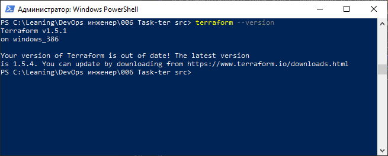
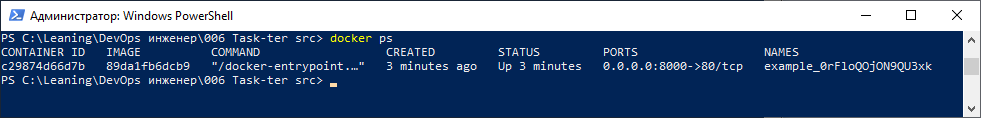
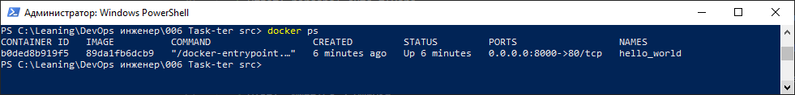

# Задание 1


1. Перейдите в каталог [**src**](https://github.com/netology-code/ter-homeworks/tree/main/01/src). Скачайте все необходимые зависимости, использованные в проекте. 
2. Изучите файл **.gitignore**. В каком terraform-файле, согласно этому .gitignore, допустимо сохранить личную, секретную информацию?
3. Выполните код проекта. Найдите  в state-файле секретное содержимое созданного ресурса **random_password**, пришлите в качестве ответа конкретный ключ и его значение.
4. Раскомментируйте блок кода, примерно расположенный на строчках 29–42 файла **main.tf**.
Выполните команду ```terraform validate```. Объясните, в чём заключаются намеренно допущенные ошибки. Исправьте их.
5. Выполните код. В качестве ответа приложите вывод команды ```docker ps```.
6. Замените имя docker-контейнера в блоке кода на ```hello_world```. Не перепутайте имя контейнера и имя образа. Мы всё ещё продолжаем использовать name = "nginx:latest". Выполните команду ```terraform apply -auto-approve```.
Объясните своими словами, в чём может быть опасность применения ключа  ```-auto-approve```. В качестве ответа дополнительно приложите вывод команды ```docker ps```.
7. Уничтожьте созданные ресурсы с помощью **terraform**. Убедитесь, что все ресурсы удалены. Приложите содержимое файла **terraform.tfstate**. 
8. Объясните, почему при этом не был удалён docker-образ **nginx:latest**. Ответ подкрепите выдержкой из документации [**провайдера docker**](https://docs.comcloud.xyz/providers/kreuzwerker/docker/latest/docs).  

# Решение

1. Скриншот текущей версии terraform:
   > 
2. Изучите файл .gitignore. В каком terraform-файле, согласно этому .gitignore, допустимо сохранить личную, секретную информацию?
   > Ответ: personal.auto.tfvars
3. Выполните код проекта. Найдите  в state-файле секретное содержимое созданного ресурса **random_password**, пришлите в качестве ответа конкретный ключ и его значение.
   > Ответ: значение **random_password**, сохраненное в ключе **result** равно **0rFloQOjON9QU3xk**
4. Раскомментируйте блок кода, примерно расположенный на строчках 29–42 файла **main.tf**.
Выполните команду ```terraform validate```. Объясните, в чём заключаются намеренно допущенные ошибки. Исправьте их.
   > Ответ: Имеется 3 ошибки:
   > - У любого блока resource должен быть тип и имя. Имя ресурса не указано
   > - Имя любого resource блока должно начинаться на букву, а в примере начинается на цифру "1"
   > - Мы должны ссылаться на ресурсы по их типу и имени, а также указывать правильно имя атрибута с учетом регистра. Ссылка **random_password.random_string_FAKE.resulT** не правильная. Правильно **random_password.random_string.result**
1. Выполните код. В качестве ответа приложите вывод команды ```docker ps```
   > 
2. Замените имя docker-контейнера в блоке кода на ```hello_world```. Не перепутайте имя контейнера и имя образа. Мы всё ещё продолжаем использовать name = "nginx:latest". Выполните команду ```terraform apply -auto-approve```.
Объясните своими словами, в чём может быть опасность применения ключа  ```-auto-approve```. В качестве ответа дополнительно приложите вывод команды ```docker ps```
> - Использование ключа ```-auto-approve``` опасно тем, что не позволяет проверить правильность планируемых изменений перед принятием решения об их выполнении.
> - Ниже приведен список контейнеров после применения команды ```terraform apply -auto-approve``` , как результат команды ```docker ps```
> 
1.  Уничтожьте созданные ресурсы с помощью **terraform**. Убедитесь, что все ресурсы удалены. Приложите содержимое файла **terraform.tfstate**.
   > Содержимое файла состояния **terraform.tfstate**:
   > {
   >  "version": 4,
   >  "terraform_version": "1.5.1",
   >  "serial": 11,
   >  "lineage": "1768697a-9065-64ac-a158-7851e6fd714c",
   >  "outputs": {},
   >  "resources": [],
   >  "check_results": null
   > }
2.  Объясните, почему при этом не был удалён docker-образ **nginx:latest**. Ответ подкрепите выдержкой из документации [**провайдера docker**](https://docs.comcloud.xyz/providers/kreuzwerker/docker/latest/docs).
   > Причина неудаления образа в том, что когда у docker_image указан атрибут ```keep_locally=true```, то такой образ не удаляется при операциях удаления, как написано в руководстве [ссылка](https://docs.comcloud.xyz/providers/kreuzwerker/docker/latest/docs/resources/image) 